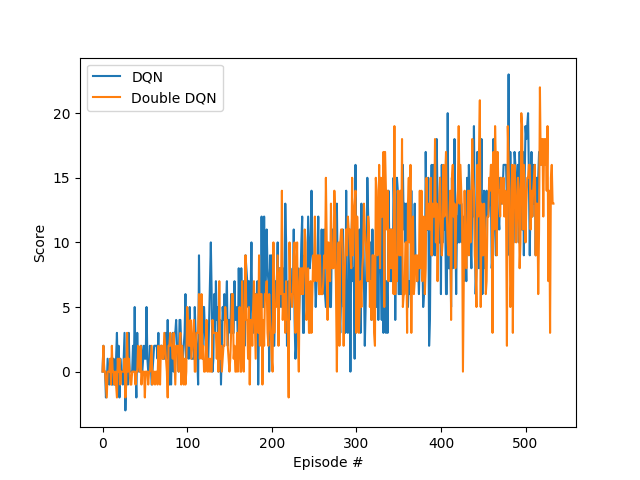

# Learning Algorithm
I trained two agents
1. A vanilla DQN agent
2. A double DQN agent that does an argmax over the local Q network to get the actions following the next states. 
   
I used the same hyper-parameters for both:

# Q-Function Model Description
The Q function model is a feedforward neural network with 37 input units with two hidden layers of 64 units and relu activations and a final linear output layer of 4 outputs.

# Plot of Rewards (DQN vs Double DQN)

# Ideas for Future Work
Double DQN does not seem to affect performance significantly on this toy problem. I suspect it may help more with the pixel version and I plan to try that. I'd also like to compare these results with a dueling-DQN model.